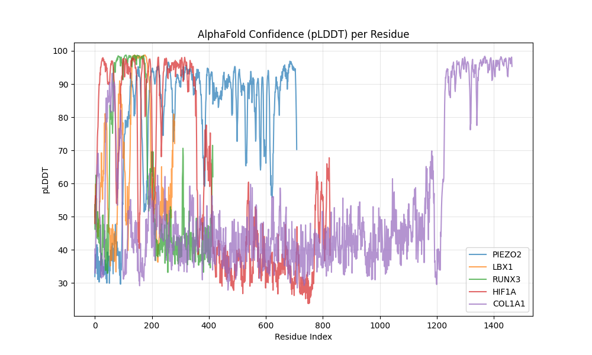
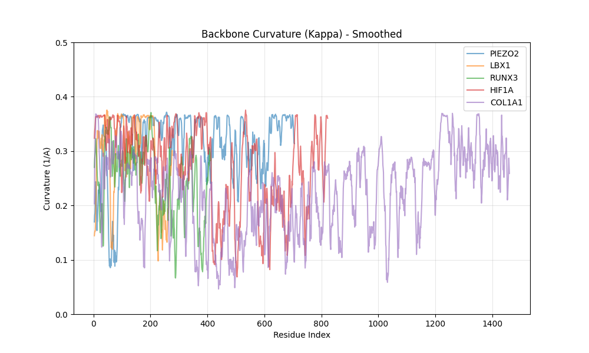

# Bolt-BioFold Analysis Report
**Date:** 2026-02-22 19:29
**Targets:** PIEZO2, LBX1, RUNX3, HIF1A, COL1A1

## 1. Results Table
|    | gene_symbol   | uniprot_id   |   plddt_mean |   anisotropy_index |   radius_of_gyration | morphology       |   hinge_candidates |   exposed_surface_proxy |
|---:|:--------------|:-------------|-------------:|-------------------:|---------------------:|:-----------------|-------------------:|------------------------:|
|  0 | PIEZO2        | Q9H5I5       |        79.44 |               4.44 |                43.41 | Fibrous/Extended |                  0 |                    0.56 |
|  1 | LBX1          | P52954       |        66.87 |               2.27 |                22.69 | Intermediate     |                  0 |                    0.93 |
|  2 | RUNX3         | Q13761       |        60.56 |               2.06 |                15.81 | Intermediate     |                 12 |                    0.78 |
|  3 | HIF1A         | Q16665       |        60.75 |               3.42 |                29.12 | Fibrous/Extended |                  9 |                    0.75 |
|  4 | COL1A1        | P02452       |        52.73 |               2.80 |                23.46 | Intermediate     |                 16 |                    0.87 |

## 2. Key Plots

## 3. Interpretation

### PIEZO2
- **Confidence Level:** Medium (Mean pLDDT: 79.4)
- **Morphology:** Fibrous/Extended (Anisotropy: 4.44)
    - High anisotropy suggests fibrous or extended conformation, consistent with structural role or force transmission.
- **Context:** Proprioception/Gravity Sensing

### LBX1
- **Confidence Level:** Low (Caution) (Mean pLDDT: 66.9)
- **Morphology:** Intermediate (Anisotropy: 2.27)
- **Context:** AIS GWAS Hit / Muscle

### RUNX3
- **Confidence Level:** Low (Caution) (Mean pLDDT: 60.6)
- **Morphology:** Intermediate (Anisotropy: 2.06)
- **Hinge Detected:** 12 potential hinge(s) found. May act as a flexible joint under load.
- **IDR Heavy:** Significant disordered regions (>30%). May involve phase separation or flexible signaling tails.
- **Context:** Proprioception Transcription Factor

### HIF1A
- **Confidence Level:** Low (Caution) (Mean pLDDT: 60.8)
- **Morphology:** Fibrous/Extended (Anisotropy: 3.42)
    - High anisotropy suggests fibrous or extended conformation, consistent with structural role or force transmission.
- **Hinge Detected:** 9 potential hinge(s) found. May act as a flexible joint under load.
- **IDR Heavy:** Significant disordered regions (>30%). May involve phase separation or flexible signaling tails.
- **Context:** Metabolic / Hypoxic Response

### COL1A1
- **Confidence Level:** Low (Caution) (Mean pLDDT: 52.7)
- **Morphology:** Intermediate (Anisotropy: 2.80)
- **Hinge Detected:** 16 potential hinge(s) found. May act as a flexible joint under load.
- **IDR Heavy:** Significant disordered regions (>30%). May involve phase separation or flexible signaling tails.
- **Context:** Structural / ECM

## 4. Best Next Move
Prioritize **PIEZO2** for mechanical testing due to extreme anisotropy (4.44).
