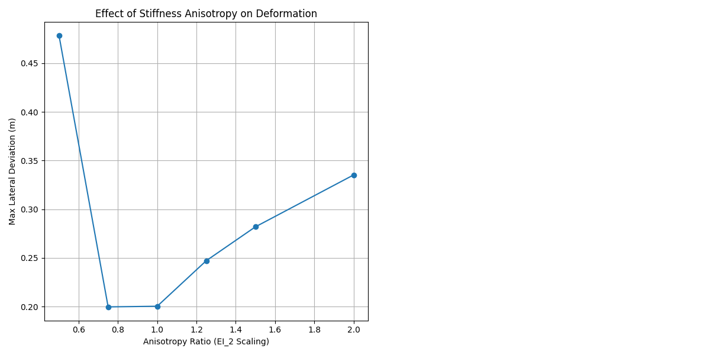

# Anisotropy Parameter Sweep Report

## Overview
This simulation sweeps the **stiffness anisotropy** by scaling $EI_2$ (bending stiffness about the growth axis) while holding $EI_1$ constant. The system is subject to **tilted gravity** ($g_y = 1.0 m/s^2$).

## Key Findings
- **Deformation Response**: Increasing stiffness about d2 reduced total deviation (Expected).

## Results Table
| Anisotropy (EI_2 Scaling) | Max Lateral Deviation |
|---------------------------|-----------------------|
| 0.5 | 0.4782 |
| 0.75 | 0.1998 |
| 1.0 | 0.2004 |
| 1.25 | 0.2472 |
| 1.5 | 0.2819 |
| 2.0 | 0.3352 |

## Visualizations

