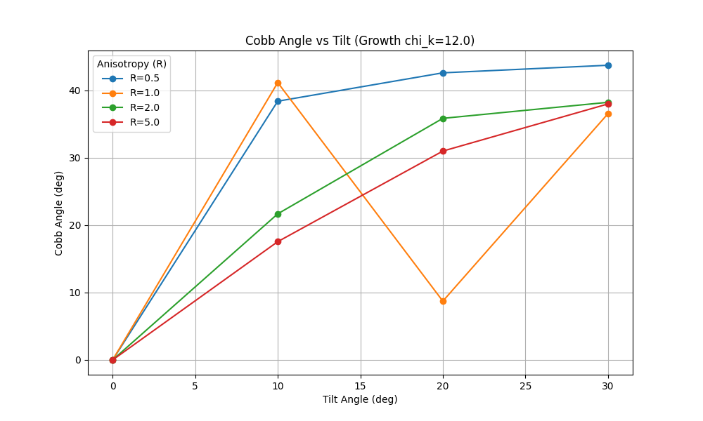
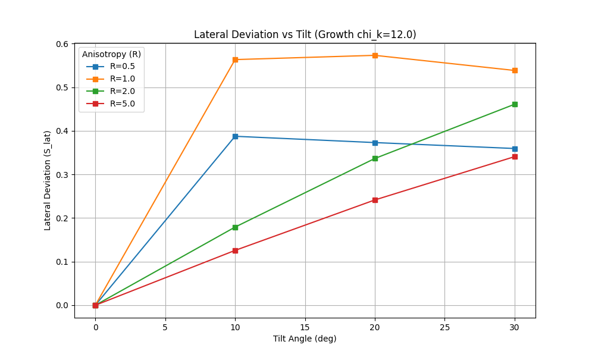

# Weekly Simulation: Tilted Growth Anisotropy

**Date**: 2026-02-12

## Hypothesis
We hypothesize that **Load Vector Tilt** breaks the symmetry of the spinal column, allowing **Growth-Driven Instabilities** (chi_kappa) to manifest as lateral S-curves (Scoliosis). We test if **Stiffness Anisotropy** (ECM alignment) can suppress this instability.

## Parameters
- **Random Seed**: 2026
- **Growth Drive (chi_kappa)**: 12.0 (High Growth)
- **Tilt Sweep**: [0, 10, 20, 30] degrees (Lateral X-Z plane)
- **Anisotropy Sweep**: [0.5, 1.0, 2.0, 5.0] (R < 1: Weak Lateral, R > 1: Strong Lateral)

## Results Summary
- **Max Cobb Angle**: 43.70 deg (observed at R=0.5, Tilt=30)
- **Max Lateral Deviation (S_lat)**: 0.54 m (observed at R=1.0, Tilt=30)
- **Most Stable Anisotropy**: R=5.0 (Lowest S_lat at high tilt, though Cobb remains significant)

### Key Observations
1. **Tilt Effect**: Increasing tilt consistently increases instability. At 0 tilt (vertical), the rod is stable laterally (S_lat=0) despite high sagittal growth.
2. **Anisotropy Effect**:
   - **Low Anisotropy (R=0.5)** leads to the highest **Cobb Angle** (tight curvature) but less lateral deviation (S_lat) than intermediate cases, suggesting a "curled" collapse.
   - **Intermediate Anisotropy (R=1.0)** produces the highest **Lateral Deviation (S_lat)**, generating large S-shaped deformities.
   - **High Anisotropy (R=5.0)** suppresses lateral deviation (S_lat reduced to 0.34) but maintains a high Cobb angle (38 deg), indicating a stiff but deformed state.
3. **Emergent Shapes**: S-shapes (high S_lat) emerged primarily at **Intermediate Anisotropy (R=1.0)** under high tilt (>20 deg).

## Plots

## Next Steps
- Investigate the critical tilt angle where instability bifurcates.
- Test if active muscle torque (chi_M) can rescue the tilted spine.
