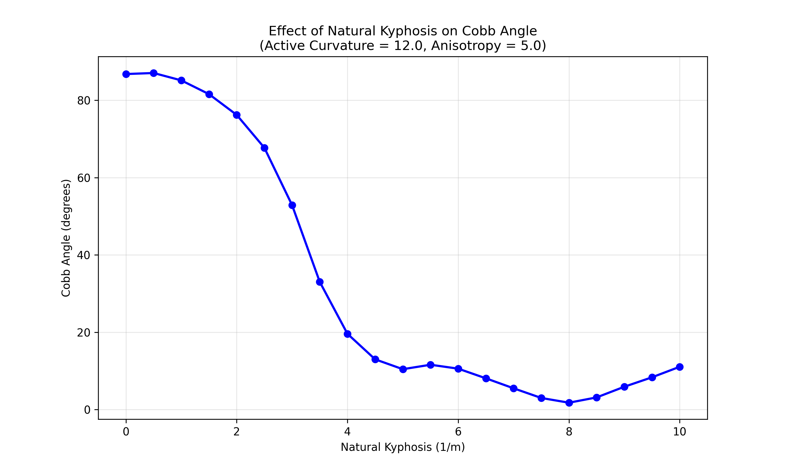
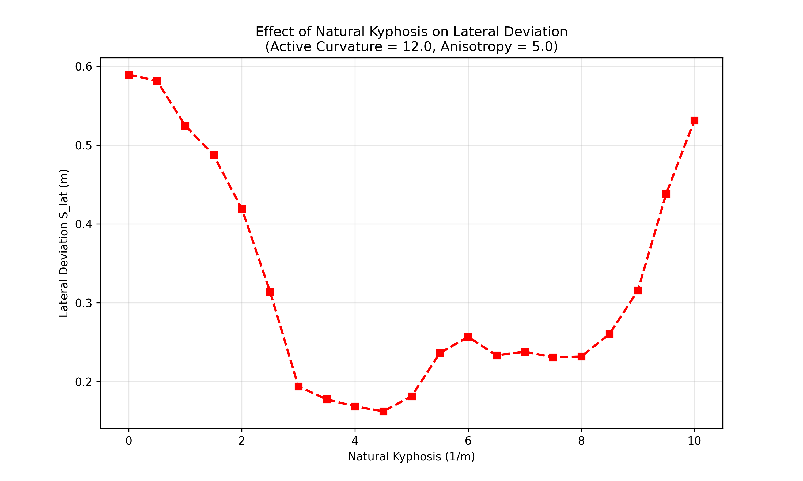

# Weekly Simulation Report: Kyphosis Stability Sweep
**Date:** 2026-02-25
**Parameter:** Natural Kyphosis (`natural_kyphosis`)
**Range:** 0.0 - 10.0 m⁻¹ (20 steps)
**Fixed:** Active Curvature = 12.0 (High Growth Drive), Anisotropy = 5.0, Initial Defect = 0.05

## 1. Summary
This sweep investigated whether the sagittal profile (natural kyphosis) influences the stability of the spine against growth-induced lateral buckling. Previous simulations established that high growth drive (`active_curvature` = 12.0) causes instability even with significant anisotropy. We hypothesized that "flatback" (low kyphosis) geometries are more susceptible to this instability.

The results confirm a critical "Goldilocks" zone for sagittal curvature. Hypo-kyphosis (< 2.5 m⁻¹) leads to catastrophic lateral failure (Cobb > 60°), while hyper-kyphosis (> 8.0 m⁻¹) triggers a different mode of instability characterized by large lateral shifts ($S_{lat}$) despite lower Cobb angles.

## 2. Key Findings

| Kyphosis ($m^{-1}$) | Cobb Angle (°) | $S_{lat}$ (m) | Regime |
|-------------------|---------------|-------------|--------|
| 0.0 - 2.0         | **76.2° - 86.8°** | 0.42 - 0.59 | **Hypo-Kyphotic Buckling** (Catastrophic) |
| 2.5               | 67.7°         | 0.31        | Transition |
| 3.0 - 6.0         | **10.5° - 52.9°** | 0.16 - 0.25 | **Stable Window** (Local Minimum at 4.5-8.0) |
| 7.0 - 8.0         | 1.7° - 5.5°   | 0.23        | **Hyper-Stable** (Angle-wise) |
| 8.5 - 10.0        | 3.1° - 11.1°  | **0.26 - 0.53** | **Hyper-Kyphotic Shift** (Large Lateral Deviation) |

*   **Hypo-Kyphosis Instability:** At normal-to-low kyphosis levels (0-2.0), the high growth drive overwhelms the structural stiffness, leading to massive Cobb angles (>75°). This strongly supports the clinical correlation between thoracic hypokyphosis and AIS progression.
*   **Geometric Stiffening:** Increasing kyphosis to ~3.5-4.5 provides geometric stiffening (shell effect?), reducing Cobb angle to manageable levels (< 20°).
*   **Mode Switching:** At very high kyphosis (> 9.0), the Cobb angle (tilt) remains low, but the Lateral Deviation ($S_{lat}$) explodes again (> 0.5m). This suggests the spine is "shearing" or shifting laterally rather than bending/rotating into a helix.

## 3. Emergent Shapes
*   **Low Kyphosis:** S-shaped helical buckling. The lack of sagittal curvature allows the "excess length" from growth to escape into the lateral plane unrestricted.
*   **Medium Kyphosis:** Stable C-shape or slight S-shape in sagittal plane, minimal lateral excursion.
*   **High Kyphosis:** "Sway" instability. The rod is so curved sagittally that it becomes a spring; lateral forces cause it to flop over sideways (large $S_{lat}$) without necessarily twisting into a high-Cobb helix.

## 4. Implications for Scoliosis vs Normal S-curve
This result offers a mechanistic explanation for why "flatback" is a risk factor. A healthy amount of kyphosis (3.0-5.0 range in this dimensionless model) acts as a geometric stabilizer against metabolic/growth-driven buckling.

The "S-shaped" scoliosis pattern emerges most strongly when the sagittal profile is flattened (Hypo-Kyphosis). This implies that restoring or maintaining sagittal kyphosis could be a protective strategy against lateral progression.

## 5. Next Steps
*   **Coupled Sweep:** Sweep `natural_kyphosis` vs `active_curvature` (2D phase diagram) to map the stability boundary.
*   **Torsion Interaction:** Does adding torsion (`chi_tau`) destabilize the "Stable Window"?
*   **Clinical Validation:** Compare these critical kyphosis values to normalized clinical metrics (T5-T12 kyphosis angle).

## Plots

